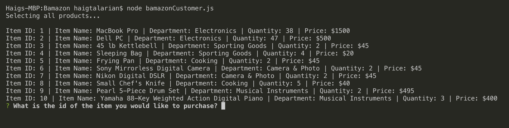
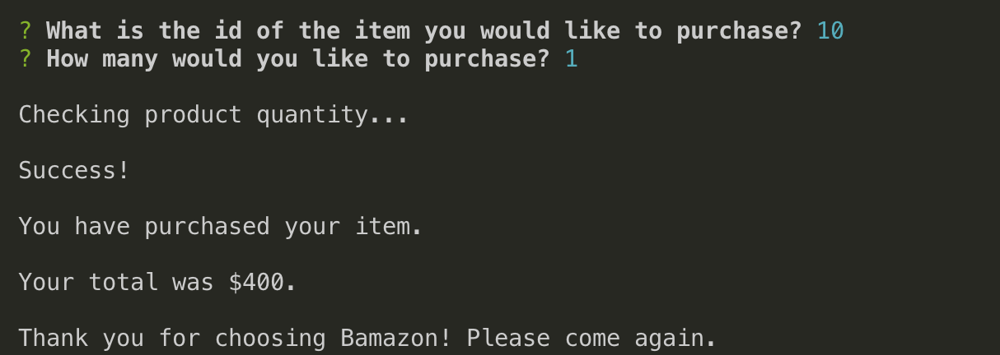
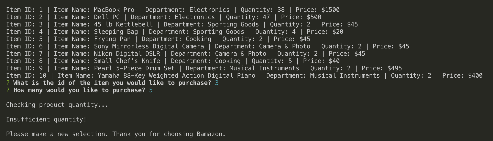

# Bamazon

Bamazon is an Amazon-like storefront. The app takes in orders from customers and depletes stock from the store's inventory utilizing MySQL as the database.

## How it works

A list of items in stock is presented to the user once the app is run:

Each item has an Item ID, the user may use these ID's to make a selection. The choice to use ID's over an item name was made due to user convenience.

The items stock is reduced by however many is purchased and the price is calculated for the user.

Bamazon will also not let you purchase too many of an item. If you want 6 pianos but Bamazon only has 4 in stock, the proper error message will be displayed and the transaction ends.

